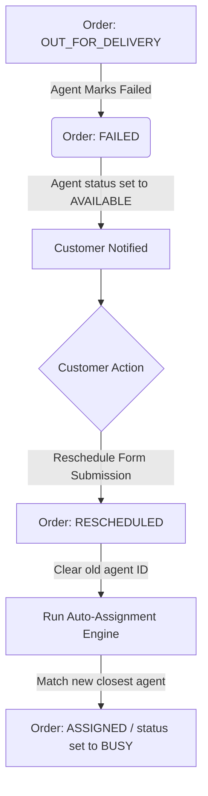

# Last-Mile Delivery Tracker - System Design Documentation

This document describes the architectural design and core logistics engines for the Last-Mile Delivery Tracker platform.

---

## 1. Rate Calculation Engine
The Rate Calculation Engine determines shipping fees dynamically based on package dimensions, weight, segment type, and payment methods. No pricing values are hardcoded in the codebase; all rates are retrieved from administrative `RateCard` configurations.

### Mathematical Formulation
1. **Volumetric Weight Calculation**:
   $$\text{Volumetric Weight (kg)} = \frac{\text{Length (cm)} \times \text{Width (cm)} \times \text{Height (cm)}}{5000}$$
2. **Chargeable Weight determination**:
   $$\text{Chargeable Weight} = \max(\text{Actual Weight}, \text{Volumetric Weight})$$
3. **Base Shipping Cost**:
   $$\text{Base Cost} = \text{Chargeable Weight} \times \text{Rate Per Kg}$$
   *   Where $\text{Rate Per Kg}$ is resolved from the matching `RateCard` (for B2B or B2C segments) as either the **Intra-Zone** tariff (same zone) or **Inter-Zone** tariff (different zones).
4. **COD Surcharge Integration**:
   $$\text{Total Delivery Charge} = \text{Base Cost} + \text{COD Surcharge}$$
   *   The COD surcharge is a flat fee added only if the payment method is Cash on Delivery (`COD`), configured independently for B2B and B2C segments.

---

## 2. Zone Detection Approach
Zones serve as geographical boundaries for routing and billing. 

*   **Pincode Mapping**: Pincodes are stored as comma-separated lists (e.g., `"110001,110002"`) inside a relational `Zone` model.
*   **Resolution Algorithm**: When an order is processed, the system strips whitespace and queries the database for a `Zone` that contains the specific pickup and drop pincodes in its string lists.
*   **Routing Classification**:
    *   **Intra-Zone**: If $\text{Pickup Zone ID} = \text{Drop Zone ID}$, shipping is local, applying lower intra-zone rates.
    *   **Inter-Zone**: If $\text{Pickup Zone ID} \neq \text{Drop Zone ID}$, shipping is regional, applying higher inter-zone rates.
    *   *Fallback*: If a pincode cannot be resolved to any zone, the engine throws a localized validation error to prevent mispriced shipments.

---

## 3. Intelligent Agent Auto-Assignment Logic
The system optimizes dispatch operations by pairing orders with the closest available courier agents.

1.  **Availability Filtering**: The engine queries `AgentProfile` records where `status = "AVAILABLE"`.
2.  **Geolocation Resolution**: Orders and agents are assigned coordinates. Pincodes are resolved to latitude/longitude coordinates via database lookups or a deterministic hashing fallback.
3.  **Proximity Distance Calculation**: The system applies the **Haversine Formula** to compute the great-circle distance between the agent's location and the pickup point:
    $$d = 2R \arcsin\left(\sqrt{\sin^2\left(\frac{\Delta \phi}{2}\right) + \cos(\phi_1)\cos(\phi_2)\sin^2\left(\frac{\Delta \lambda}{2}\right)}\right)$$
    *   Where $R = 6371\text{ km}$ (Earth radius), $\phi$ is latitude, and $\lambda$ is longitude.
4.  **Assignment Execution**:
    *   The engine prioritizes available agents situated within the order's pickup zone.
    *   If multiple agents match, it selects the agent with the minimum distance $d$.
    *   The order updates to `ASSIGNED`, the agent's status shifts to `BUSY` (preventing double booking), and tracking logs register the match.
    *   If no agents are available, the order remains in `PENDING` for manual override.

---

## 4. Failed Delivery and Rescheduling Flow
Logistics exceptions are handled through a state-machine that ensures agent utilization and customer transparency.

1.  **Failure Capture**: An agent updates the status to `FAILED`, inputting a reason. The agent's profile immediately reverts to `AVAILABLE` to allow them to take other deliveries.
2.  **Customer Notification**: The system logs a notification (simulated SMS/Email feed) alert.
3.  **Rescheduling Request**: The customer inputs a new delivery date and instructions.
4.  **Reassignment execution**: The database updates status to `RESCHEDULED`, sets the new scheduled date, clears the previous `agentId` (null), and runs the **Auto-Assignment Engine** to dispatch the nearest available agent for the new slot.
